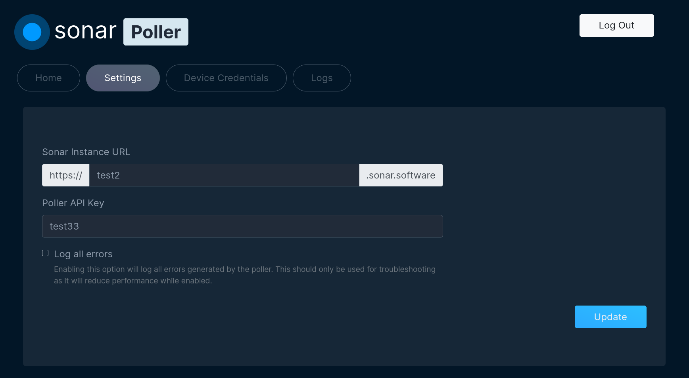

# Sonar Poller



## Introduction

This poller provides a way to collect data from your network and return it to Sonar. This poller only works with Sonar v2 - please check out the [legacy poller](https://github.com/sonarsoftwareinc/poller-v1) if you're on Sonar version 1.

## Installation

Feel free to reach out to Sonar support if you need assistance getting the poller up and running.

The poller is designed to run on [Ubuntu 20 Server Edition](https://releases.ubuntu.com/20.04.1/ubuntu-20.04.1-live-server-amd64.iso). Install on bare metal or a VM, and then follow the steps below.

1. From the command line, enter `wget https://raw.githubusercontent.com/SonarSoftwareInc/poller/master/setup.sh`
2. Enter `chmod +x setup.sh`
3. Enter `sudo ./setup.sh`

The poller should automatically install and get up and running. Once this is complete, you can access the poller web interface by navigating to `https://SERVER_IP` in a browser, where `SERVER_IP` is the IP address of the server you installed the poller on.

Login using your Sonar credentials, navigate to the `Settings` tab and enter the necessary information. To receive a poller API key, you'll need to add the poller into Sonar under **Settings > Monitoring > Pollers**. Now navigate to the `Device Credentials` tab and enter any applicable credentials.

## For developers
### Adding new types of devices

Edit `config/devices.json` and add a response value which should be the response to an SNMP get to `1.3.6.1.2.1.1.2.0`. Add a device value which is a string representing the entire namespace and class name of the mapper in question.

If the class name is a mapper inside `src/DeviceMappers`, then the mapper must extend `BaseDeviceMapper`. If the class name is an identifier inside `src/DeviceIdentifiers`, then the identifier must implement `IdentifierInterface`. Almost all responses should be a mapper - the identifier path is only needed if the vendor doesn't uniquely identify their devices by a response to `1.3.6.1.2.1.1.2.0`.

Check out an existing mapper for examples of the best way to implement a new one. The Netonix/Ws6Mini, Ubiquiti/Toughswitch or MikroTik/MikroTik mappers have examples of using non-SNMP based data collection as well.

### Polling HTTP Request/Response Structure
The polling agent monitors the status of devices via SNMP gets and ICMP echos. Sonar provides a list of devices along with the information that is configured in Sonar's settings to be requested from each device on request. The poller is then expected to perform the status monitoring queries and submit the results back to Sonar.
#### Requesting the Device List and Monitoring Templates From Sonar
To get the list of devices that need to be polled and the polling templates to use, an HTTP POST request is sent to [`https://URL.sonar.software/api/poller`](https://URL.sonar.software/api/poller). The request and response formats are as follows:
##### Request Headers
``` json5
{
    "User-Agent": "SonarPoller/v2.0.12-5-g3e1048b", // SonarPoller/{version}
    "Accept": "application/json",
    "Accept-Encoding": "gzip",
    "Content-Type": "application/json"
}

```
##### Request JSON Body
``` json5
{
    "api_key": "xxxxxxxx-xxxx-xxxx-xxxx-xxxxxxxxxxxx", // Sonar settings -> Monitoring -> Pollers
    "version": "2.0.12-5-g3e1048b" // output of `git describe --tags`
}
```
##### Response Body
``` json5
{
    "data": {
        "hosts": {
            "645": {
                "ip": "a.b.c.d",
                "monitoring_template_id": 5,
                "snmp_overrides": [],
                "type": "network_sites",
                "polling_priority": 3
            },
            ...
        },
        "monitoring_templates": {
            "5": {
                "icmp": true, // if false, no ICMP data is requested
                "collect_interface_statistics": true, // if false, interface data not requested
                "snmp_version": 2, // if null, SNMP data not requested
                "snmp_community": "public",
                "snmp3_sec_level": null,
                "snmp3_auth_protocol": null,
                "snmp3_auth_passphrase": null,
                "snmp3_priv_protocol": null,
                "snmp3_priv_passphrase": null,
                "snmp3_context_name": null,
                "snmp3_context_engine_id": null,
                "oids": []
            },
            ...
        }
    }
}
```

#### Providing the Monitoring Results to Sonar
Using the device list and the information in the matching monitoring template, each device in the above request is polled via ICMP pings and SNMP gets. The SNMP gets are performed for every oid in the device's monitoring template oid list. The results are submitted to [`https://URL.sonar.software/api/batch_poller`](https://URL.sonar.software/api/batch_poller) in the format below.

##### Request Headers

``` json5
{
    "User-Agent": "SonarPoller/v2.0.12-5-g3e1048b", // SonarPoller/{version}
    "Accept": "application/json",
    "Accept-Encoding": "gzip",
    "Content-Type": "application/json"
}
```

##### Request Body
``` json5
{
    "api_key": "xxxxxxxx-xxxx-xxxx-xxxx-xxxxxxxxxxxx", // Sonar settings -> Monitoring -> Pollers
    "version": "2.0.12-5-g3e1048b", // output of `git describe --tags`
    "time_taken": 0.34, // in secoonds
    "results": {
        "123": { // Sonar item ID
            "icmp": {
                "low": 12.34, // in miliseconds
                "high": 12.34, // in miliseconds
                "median": 12.34, // in miliseconds
                "loss_percentage": 13.8 // -> (# fails + # timeouts)/(total # attempts)
            },
            "snmp": {
                "up": true,
                "message": "", // used for error messages
                "metadata": {
                    "contact": "...",
                    "name": "...",
                    "location": "...",
                    "uptime": "...",
                    "description": "..."
                },
                "interfaces": {
                    "1": { // Last number in the oid string
                        "id": 1, // Last number in the oid string
                        "description": "...",
                        "up": tru,
                        "connected_11": [ // layer 1 connections (wireless connections by default)
                            "FF:FF:FF:FF:FF:FF",
                            ...
                        ],
                        "connected_12": [ // layer 2 connections (e.g. by bridge)
                            "FF:FF:FF:FF:FF:FF",
                            ...
                        ],
                        "connected_13": [ // layer 3 connections (e.g. arp table)
                            "FF:FF:FF:FF:FF:FF",
                            ...
                        ],
                        "speed_mbps_in": 123.45, // DL in Mbps
                        "speed_mbps_out": 12.34, // UL in Mbps
                        "ip_addresses": [
                            "1.1.1.1/32",
                            ...
                        ],
                        "mac_address": "FF:FF:FF:FF:FF:FF",
                        "type": 6, // 6 -> Ethernet; IANA MIB-II ifTable type
                        "pps_in": 1233456, // rx packets per second
                        "pps_out": 123456, // tx packets per second
                        "octets_in": 123456,
                        "octets_out": 123456,
                        "errors_in": 123456,
                        "errors_out": 123456,
                        "discards_in": 123456,
                        "discards_out": 123456
                    },
                },
                "results": {
                    "counters": { // any value with a COUNTER type goes in here
                        ".1.3.6...": "0",
                        ...
                    },
                    "others": { // any non COUNTER typed value goes here
                        ".1.3.6...": "0",
                        ...
                    }
                }
            }
        },
        ...
    }
}
```
#### Defaults
##### ICMP Ping
The poller performs ICMP pings using the following command
``` bash
interval=$(( 500 + $RANDOM % 500 ))    # Random number in the range [500,1000]
/usr/local/sbin/fping -b12 \           # 12 byte packet
                      -p${interval} \  # interval between ping packets
                      -r0 \            # no retries
                      -B1.5 \          # backoff multiplier
                      -q \             # quiet
                      -R               # use random bytes instead of 0x0
```

## Basic CLI Operation
### Starting/Stopping the poller service

Run `supervisorctl restart sonar_poller` to restart the poller

Run `supervisorctl stop sonar_poller` to stop the poller

### Enabling Debug Mode

You will need to set the environment variable `SONAR_DEBUG_MODE`, setting it to 1 will enable debugging, and setting it to 0 will disable debugging.

Run `export SONAR_DEBUG_MODE=1` to enable debugging

Run `export SONAR_DEBUG_MODE=0` to disable debugging

Restart the poller (see the supervisorctl commands above) to enable the changes to take effect
